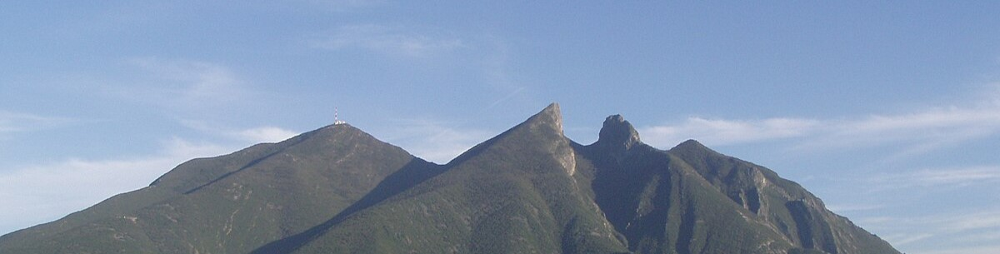

  

## Hola soy Diego Calva Valdés👋
### Bienvenido a mi perfil

#### ingeniero administrador de sistemas
#### Graduado de la Facultad de Ingeniería Mecánica y Eléctrica de la Universidad Autonoma de Nuevo León 

Me gusta desarrollar y participar en proyectos interesantes, que me reten y me hagan crecer profesionalmente. 

- 🔭 Actualmente he trabajado con las siguientes tecnologias:
   - 
   - 
   - 
   - 
   - 
   - 

- 📓📚 Actualmente estoy aprendiendo javascript y REACT
  
        

contacto: diegocalva2002@gmail.com

